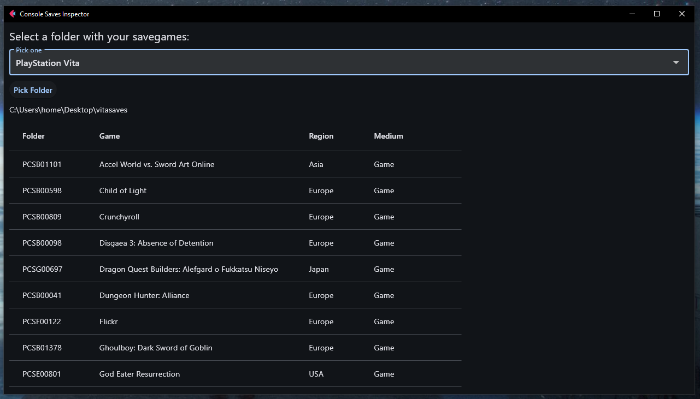

# 🎮 PS3 Saves Inspector

A lightweight tool to inspect PlayStation 3 save game folders and display the names of the games based on their Title IDs!

Yet another [Flet](https://flet.dev/) project for a simple and clean desktop UI. Built because I backed up my ps3 saves, and apparently I had close to 300, which made it a bit hard to find specific ones.

---

## ✨ Features

- ✅ Select a folder containing PS3 save games
- 🔍 Automatically display game titles using `title_ids.txt`
- ⚡️ Fast, minimal interface (no internet required)
- 🌍 Displays the game region
- 📼 Displays also the game medium, albeit for some reason this is a hit or miss
- 🆎 Clicking on any of the table headers will order the entries alphabetically based on that column

---

## 📸 Screenshot


  - For some reason, my savegame for the Japanese copy of Puppeteer appears as Buzz Junior Dinomania. Somehow they have the same title ID.

---

## 🚀 Getting Started

### Option 1: Run from Source

1. Clone the repo:
  ```bash
  git clone https://github.com/smoothini/ps3-saves-inspector.git
  cd ps3-saves-inspector
  ```
2. Install dependencies
  ```bash
  pip install flet
  ```
3. Run the app, while making sure the `titleid.txt` file is in the same location as the `app.py`
  ```bash
  python app.py
  ```
4. Select a folder where you have multiple PS3 save games
5. ✨ Enjoy! ✨

### Option 2: Standalone Executable

  - Coming soon


## 🙋‍♂️ Contributing
Pull requests and suggestions are welcome!
If you'd like to add more Title IDs or improve the UI, feel free to fork and submit a PR.

## 📜 License

This project is licensed under the [MIT License](LICENSE).  
You are free to use, modify, and distribute it, even in commercial applications — just include the original license.

© 2025 Smoothini